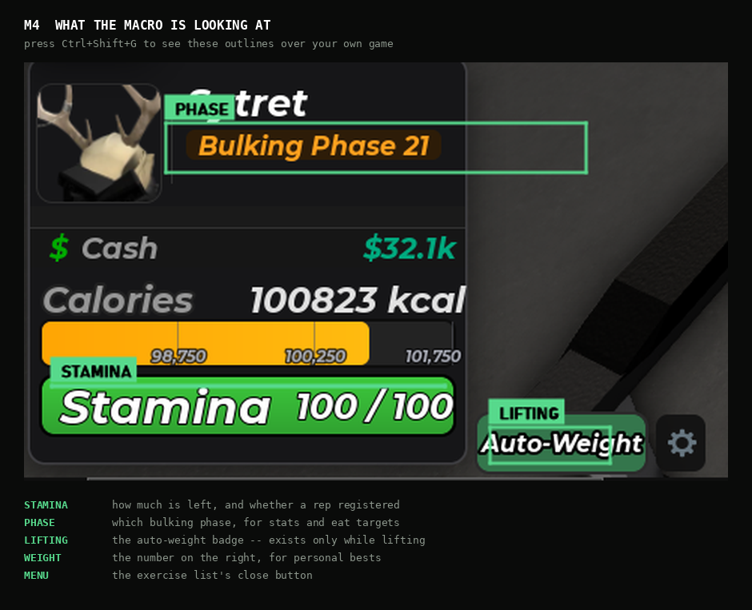
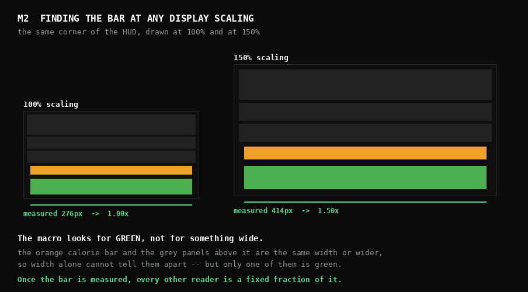
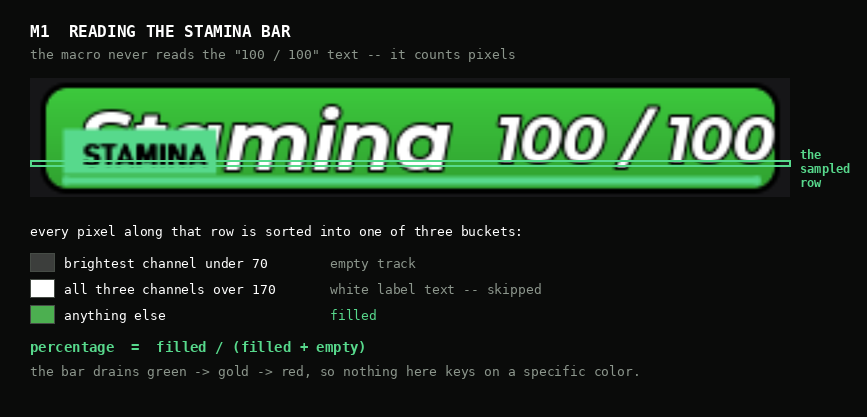
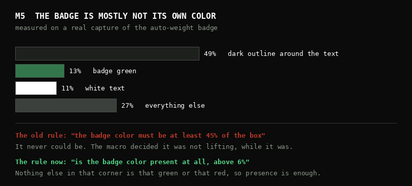
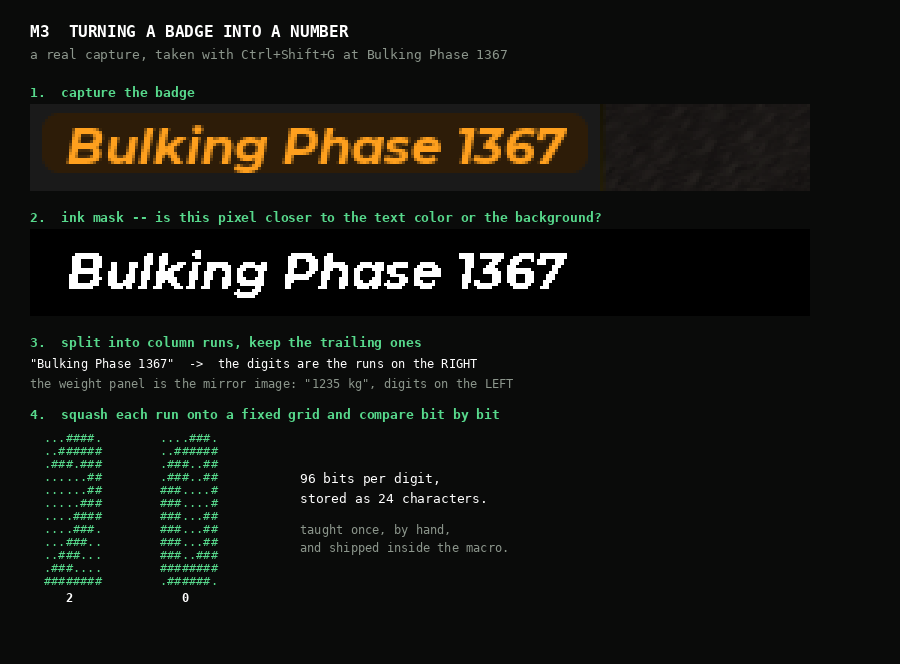

# SPEARHEADS · Ultimate Gym Game Macro

**v3.1.1** - a ground-up rebuild. AutoHotkey v2, one file, no dependencies.

This document explains not just *what* the macro does but *why* it does it that
way. Most of the design exists because something simpler was tried first and
failed in a specific yet interesting manner. Those failures are written down here
deliberately for others to learn from my personal mistakes.

No prior knowledge is assumed.

---

## Contents

1. [What it does](#what-it-does)
2. [Three ideas that shape everything](#three-ideas-that-shape-everything)
3. [Shortcuts](#shortcuts)
4. [Seeing the screen](#seeing-the-screen)
5. [Reading numbers](#reading-numbers)
6. [The lifting loop](#the-lifting-loop)
7. [Running without readers](#running-without-readers)
8. [Eating and the shaker](#eating-and-the-shaker)
9. [Reporting and updates](#reporting-and-updates)
10. [The interface](#the-interface)
11. [Field notes: bugs and what they taught](#field-notes-bugs-and-what-they-taught)
12. [Where to change things](#where-to-change-things)

---

## What it does

Ultimate Gym Game is a Roblox game where you lift, eat, and climb bulking
phases. Every macro is allowed so over a long session the fastest one wins.

The macro:

- loops lifting sets indefinitely, reading progress off the screen
- buys and eats chicken at the vendor
- assembles shakers
- reports to Discord
- checks for its own updates

and shows all of the information and settings in a custom drawn panel.

**12 machines, 42 menu rows, 43 selectable exercises.** Those numbers are
derived from the catalog. The game has gained an exercise since this rebuild
began (Shrug, on the Squat Rack) which is exactly why nothing counts them by
hand.

It has **no memory of game state it could instead look at**. It never remembers
whether auto-weight is on, what the current weight is, or which phase you are
in. It reads all of it, every time.

---

## Three ideas that shape everything

### 1. Anchor to the client rect.

Every coordinate is a distance from an edge of the **Roblox client area**, never
from the screen. A HUD element's position relative to the screen is meaningless.
Things like windowed mode, taskbar height and OS changes it. Relative to the
client makes reading stable.

This one decision makes windowed, fullscreen, Windows 10 and 11 behave
identically and it is why the macro works at any resolution (I hope).

### 2. Verify.

Anything the macro can check, it checks:

- A rep is confirmed by watching the stamina bar drop. No drop means the click
  was swallowed, so it clicks again.
- Auto-weight being on is confirmed by reading its badge, never by remembering
  that a key was pressed.
- The exercise menu is confirmed open... Twice, before a single navigation key
  is sent.
- The chicken drain walks **every** hotbar slot. Not inventory (yet).

### 3. Fail and inform.

A reader that cannot read returns `ok: false` and a reason. It never returns a
plausible-looking number it did not actually measure. A session that stops with
an explanation costs minutes; a session that quietly runs eight hours at Deficit
wasted hours of possible progress.

And when a reader stops working mid-session, it does not end the run. It falls
back to fixed timings, tells you which one gave up, and keeps going. Covered by
a video window is not a reason to lose an hour of lifting.

---

## Shortcuts

### Default actions. All reassignable.

| Default | Does                  |
| ------- | --------------------- |
| `F8`    | lift, **Strength**    |
| `F7`    | lift, **Hypertrophy** |
| `F6`    | eat                   |
| `F5`    | shaker                |
| `F9`    | quit                  |

Pressing the *other* lift key mid-run queues a mode switch for the end of the
current set. Pressing the *same* key again stops.

Binds are registered as bare keys, so a bind of `v` fires on `v` alone and never
on `Ctrl+Shift+V`. This allows for your binds and my debug keys to share a letter.

The navigation key is reassignable too, under Settings. Which physical key
carries `\` moves with the keyboard layout, so a hardcoded default was quietly
sending the wrong key on German and French keyboards.

### Diagnostics & Debugging

| Key            | Does                                                  |
| -------------- | ----------------------------------------------------- |
| `Ctrl+Shift+D` | self-test dump: every region, every reader            |
| `Ctrl+Shift+V` | read the phase and weight numbers back                |
| `Ctrl+Shift+G` | dump both digit regions to BMP (raw + ink mask)       |
| `Ctrl+Shift+R` | live stamina / lifting / menu readout                 |
| `Ctrl+Shift+N` | re-send the navigation toggle by hand                 |
| `Ctrl+Shift+B` | send a webhook test post                              |
| `Ctrl+Shift+M` | cycle input mode: **LIVE → DRY → STEP**               |
| `F10`          | STEP mode: release exactly one input                  |
| `Ctrl+Shift+L` | HUD overlay: mode, state, last inputs                 |
| `Ctrl+Shift+P` | probe: cursor position in client coords and its color |
| `Ctrl+Shift+U` | update status, re-check on demand                     |
| `Ctrl+Shift+F` | show / hide the panel, or drag it back on screen      |
| `Ctrl+Shift+X` | panic stop                                            |

**DRY** computes and logs every keypress without sending it. **STEP** releases
one input per `F10`. Both write to `transcript.txt`. STEP mode found a bug that
was invisible any other way. Check [field notes](#step-mode-earning-its-keep).

Everything the macro writes goes to `%APPDATA%\UGGMacro\` - settings, stats,
transcript, self-test dumps, region captures. People run this straight out of
their downloads folder and a log that lands there is a log nobody can find when
it is actually needed.

---

## Seeing the screen



*The five regions the macro watches. Press `Ctrl+Shift+G` to see these outlines
over your own game.*

### The anchor model

Four ways to place a region, matching the four ways the game anchors things:

```
BL(L, B, w, h)    left edge  + bottom edge      the HUD cluster
BR(R, B, w, h)    right edge + bottom edge      the weight panel
C (dx, dy, w, h)  from the client center        menus, dialogs
CB(dx, B, w, h)   centered + bottom edge        shaker row, banners
```

Verified against measurements taken in **both** windowed (1920×1017) and
fullscreen (1920×1080), as well as 800x600, 1280x720 and 1440x900 for verification.
The point of measuring that is that the anchored axis reads *identically* in each.
That is what proves the model. Where a value differs by ~63px, that axis is not the anchor.

Holds to ≤1px in both modes: the exercise menu, the disconnect dialog and its
Reconnect button, the shaker slot row.

One value does **not** hold. The calorie bar's documented formula
`B = 0.0434h + 33` is out by 10px windowed and 12px fullscreen. Nothing depends
on it and it is recorded as wrong rather than quietly carried forward.

### Windows display scaling

The anchor model handles resolution. It does **not** handle scaling, and that
turned out to be the single largest source of "works for me, broken for him".

Two separate things were going wrong.

The first is that Windows was lying to the macro. Without declaring itself DPI
aware, a program asking Windows how big the Roblox window is gets an answer in
*logical* pixels, while a screen capture returns *physical* ones. At 125% a
window that is really 1920 wide reports as 1536. The error is zero at the corner
of the window and grows across the screen, which is why the stamina bar in the
bottom-left often still worked while the phase badge further right never did.
The macro now declares DPI awareness before it creates a single window, so both
numbers mean the same thing.

The second is that the HUD itself grows. At 150% the stamina bar is not 274px
wide, it is 411. So the macro measures it.

### Calibration



The stamina bar is found, measured, and everything else is derived from it. A
411px bar means the HUD is at 150%, and the phase badge, the weight panel and
the auto-weight badge are all a fixed fraction of that measurement.

Checked against captures at 100%, 125%, 150% and 175% on two resolutions: every
derived position lands within 3px of where it actually is.

The scan itself is described below, because getting it right took three attempts.

### The stamina bar



The core measurement. A single 1px-tall row across the bar, every column
classified:

```
min channel > 170  ->  white label text   skip
max channel <  70  ->  empty track        skip
otherwise          ->  filled             count
```

The bar drains green -> gold -> red, so the test never keys on a hue, instead it
works based on saturation. This idea came from Petiqe, a fellow Tester:

"It doesn't read the "100 / 100" text, it can't read numbers. It reads the bar itself.

[...] Bright saturated color = filled, dark = empty. Count how many across are filled,
and that's your percentage. [...] It's done by color vividness, not a specific color, because
the bar goes green → gold → red as it drains, so matching one exact color would break
the moment it changed shades."

My version takes inspiration from that, but on the text level.

**Finding the bar is a separate problem to reading it**, and the harder of the
two. The first version predicted where the row should be from a formula and
searched a few pixels either side. The second looked for the widest bright strip
in the corner. Both worked on my machine and broke on other people's, because
the player card, the cash row and the calories row are all about the same width
as the bar, and at some scalings they are wider.

What works is looking for **green**.

1. Count green pixels on every row in the bottom-left corner. The row with the
   most of it is inside the bar, by definition.
2. Grow left and right from there until the pixels go dark. That is the bar's
   real width, and the white label in the middle gets stepped over rather than
   treated as the end.
3. Grow up and down while rows still look like the bar.
4. Within that span, pick the row with the most fill and the least white text,
   preferring the middle when several tie.

Nothing in that sequence knows or cares where the bar sits on screen. The
calorie bar directly above it is orange, the panels are grey, and a green pixel
in that corner is the stamina bar or it is nothing. If you have drained the bar
below green it falls back to any saturated fill, so a gold or red bar still
calibrates.

Step 4 matters more than it sounds. The bar has rounded corners, so rows near
its top and bottom edges are genuinely narrower and start further right - one
tester was calibrating at 272px starting 6px late, which put every derived
region slightly off and made the menu reader look at the wrong place.

If it cannot find the bar at all, it says so and offers you the candidates it
did find. Hovering one outlines it over the game so you can pick the right one
by looking at it rather than reading numbers.

### The other readers



**Auto-weight badge**: solid `8A3E3E` off, `34764C` on. It exists *only* in the
lifting state, so one scan answers both "am I lifting" and "is auto-weight on".

The rule used to be "the badge color must be most of the box". It cannot be. The
badge's label has a heavy dark outline that covers about half of it, so the
badge's own color is only ever a minority of its own pixels - 13% on a real
capture, against a rule demanding 45%. The macro sat there deciding it was not
lifting while it was. It now asks whether the color is **present at all**, above
6%. Nothing else in that corner is that green or that red.

**Phase badge**: four background colors. For Cutting and Deficit, since they are
only 6.4 apart in RGB space, a first match wins scan attributes comparing the
known Deficit and Cutting. Deficit pixels to Cutting. Classification is
nearest-neighbour with a majority vote, exact up to a per-pixel error of 3.2.
Halving the room for error directly.

**Exercise menu**: detected by its close X. Used to interfere with the NATIONAL and INTERNAITONAL text color. It also used to accept clothing that looked similar, such as a red shirt so it had to be tightened down by hue and brightness:

```
R >= 200  and  70 <= G <= 150  and  70 <= B <= 150  and  |G - B| <= 14
```

**Disconnect dialog**: Check [field notes](#the-tester-in-the-white-shirt).

### When a reader stops working

Every reader can be switched off individually under Settings, and each one that
goes off is replaced by a fixed timing. See [Running without readers](#running-without-readers).

A reader can also switch *itself* off. If the menu reader comes up empty three
cycles in a row - something is covering it, a video window, picture-in-picture,
or the macro's own panel - it drops to timings, posts to Discord saying which
one and why, and the run continues. The Readers page shows it as `AUTO` with a
button to try again once whatever it was has moved.

Before this, a covered reader meant the macro looped and then failed, and the
only workaround was knowing in advance to turn it off yourself.

---

## Reading numbers

The game shows two numbers the macro cares about: the bulking phase and the
weight being lifted. Neither is available except as pixels.

### Why templates are taught rather than generated

The obvious approach is to render the game's fonts and generate digit templates
from them. I tried. Rendered glyphs matched hand-taught ones at only
**~13 bits out of 96**. This is nowhere near close enough, given the two most similar
digits are only 18 bits apart (15 and 18).

So templates were taught once, by me. Manually and then shipped inside the macro
itself so nobody has to go through the pain I had to go through.
Unless you use a custom font.

### The pipeline



```
capture region  ->  ink mask  ->  column runs  ->  normalize  ->  match
```

**Ink mask.** A pixel is ink if it is closer to the text color than to the background
color. Antialiasing resolves itself because edge pixels fall to whichever
side they resemble, with no hand-tuned threshold.

**Column runs.** Vertical slices containing ink, separated by empty columns.

**Normalize.** Each run is cropped to its ink bounding box and sampled onto a
fixed grid, producing a bitmap independent of where in the panel the text sits.

**Match.** Compare against every taught template by counting differing bits
(Hamming distance) and take the closest.

Two real glyphs, taught from an actual capture of `Bulking Phase 20`:

```
   ...####.        ....###.
   ..######        ..######
   .###.###        .###..##
   ......##        .###..##
   ......##        ###....#
   .....###        ###....#
   ....####        ###...##
   ....###.        ###...##
   ...###..        ###...##
   ..###...        ###..###
   .###....        ########
   ########        .######.
       2               0
```

That is exactly what the macro stores: 96 bits per glyph, 24 hexadecimal characters.

### The two panels are mirror images

```
phase    "Bulking Phase 20"    digits TRAIL, lettering leads
weight   "1235 kg"             digits LEAD,  the kg suffix trails
```

So isolation walks *outward from the number's end* and stops at the first thing
that is not part of it: a word-sized gap or a run matching no digit. Between digits
it is 1 to 3px, between the number and its neighbor it is 5px on the phase badge
and 16px before `kg`.

### Touching digits

In the phase badge's italic font some pairs **touch**. For example `15` and `18` have no
empty column between them, while `16`, `17` and `19` do.
Which makes splitting them through my usual width threshold fail.

Instead, a run wide enough to hold more than one glyph is scored *every* way as one
glyph and recursively as every possible split (20 and beyond). Whichever reads best
per glyph wins, similar to our color approach.
Bulking Phase is unbounded, so three-digit phases take the same path.

### Long phases

Someone reached Bulking Phase 304 and the macro read it as 9.

The glyphs were fine. The capture box was not - it was sized for
`Bulking Phase 20` and the third digit fell outside it entirely, so the
right-to-left isolation read whatever was left. The box is wider now and scales
with the HUD, comfortably fitting four digits at any scaling.

Worth knowing if you are ever tempted to re-teach: the pill grows with the
number but **the digits do not**. A capture of Phase 1367 has 12px tall digits,
exactly like Phase 20. The shipped templates are correct at any digit count.

### Two thresholds, both proportional

A match is accepted only if it is within `GLYPH_MAXDIST_PCT` of the bit count
**and** beats the runner-up by `GLYPH_MARGIN_PCT`. The margin matters more than
the distance: two glyphs that genuinely resemble each other are both within any
sane distance limit, and only the gap between them says which it is.

| | grid | bits | accept | margin | closest pair |
|---|---|---|---|---|---|
| phase | 8×12 | 96 | ≤19 | ≥5 | `0`/`6` at 18 |
| weight | 14×18 | 252 | ≤50 | ≥13 | `8`/`9` at 37 |

The grid differs because the source glyphs do: phase digits are ~10×14 pixels,
weight digits ~26×31. Squashing weight to 8×12 left `3` and `5` only 12 bits
apart. This means they are still inside the accept threshold but... Should be fine.

The shipped templates were verified against every phase from 1 to 20 and a range
of weights, all reading at **0 bits off**, and have since read 114, 304 and 1367
correctly without ever being taught them.

---

## The lifting loop

### Two modes

| Mode | Reps | Behavior |
|---|---|---|
| **Hypertrophy** | 6 | waits for a full bar |
| **Strength** | 1 | cancels the moment the rep registers, restarts immediately |

Strength enters at **40%** stamina rather than waiting for full because a rep
costs about a third of the bar. If you are doing a lift too difficult, the built in
2.5s cooldown kicks in and the macro keeps clicking until it succeeds.
The navigation covers most of the time wasted to regenerate stamina.
These names match the game's own lifting modes, so **one setting
drives both.**
For example: Picking Strength in the macro will set Strength in the auto-weight menu.
Two controls that must agree are two controls that can disagree.

There used to be three modes. The old Strength did 3 reps and waited for a full
bar, which is the same job Bullet was doing and doing worse, so Bullet became
Strength and the slower duplicate is gone.

### The clean slate

Every loop begins and ends identically: no menu open, not lifting, navigation
off. That's the only thing to keep in mind when turning the macro on.

```
 1 clean slate    navigation off, client rect refreshed
 2 enter          tap E, only if no menu is already on screen
 3 navigate       nav on -> lands on the menu's close X -> Down x row
 4 wait HERE      Wait for stamina to refill on exercise row.
 5 commit         Enter, then confirm the lifting state from the badges
 6 settle + read  auto-weight recalculates; read the weight for personal bests
 7 auto-weight    only if the badge reads off or the mode changed
 8 nav off        reps are clicks at the cursor; navigation swallows them
 9 reps           click -> settle -> read stamina -> afford another?
10 leave          Space, then settle so the menu can open again
```

**Step 4 is the whole efficiency argument.** Stamina regeneration is the binding
constraint, not the macro — a full bar takes about six seconds with no boosts.
Steps 2 and 3 run *inside* that window, so navigation costs nothing the recharge
was not already costing. Entering the machine early would be worse than useless:
regeneration does not tick while you are on a machine (until 2.5s later).

### Navigation is only ever enabled onto a known anchor

Turning navigation on with nothing open lands the cursor on the **left-hand HUD
button column**, where every subsequent Down walks the HUD instead of the
exercise list. This is why it proceeds once the menu is confirmed open from **two
consecutive polls**, so a single false positive cannot do it. This is
re-checked after the toggle as well. If the menu has gone, the loop backs out to the
clean slate rather than walking the HUD.

Navigation is a toggle, so its state is tracked explicitly rather than assumed.

### The rep verifies itself

The stamina bar moves when the rep *animation* plays, not exactly when the click
lands, so the read waits `REP_READ_MS`. A drop proves the rep registered; no drop
means the click was swallowed, so it repeats.

It will do that up to 20 times, one click every 300ms. That is six seconds of
trying, which sounds excessive until you remember that an extra click during a
rep is simply ignored by the game while a missed window costs the whole set.
People on poor connections were losing sets to a budget that was too tight.

Reps are stamina-driven: cost is measured per rep and smoothed and the set
continues while there is enough left for another at its measured price.
A fixed count assumes full-price reps and stops one short on cheap exercises
or wastes time on a third impossible rep.

### Lag

A slow server used to end the session. The macro would send Enter, wait 900ms
for the lifting badge, decide the commit had failed, back out, and eventually
give up - all while the game was about to put it on the machine.

Timeouts are wider now, and more importantly a timeout **looks at the screen
again before concluding anything**. If the exercise menu is still open then the
Enter never landed, so it re-commits rather than tearing down a position that
was one moment away from working. Being slow to notice a real fault costs one
cycle. Crying fault on a lag spike costs the run.

### Trash

Trash spawns around the gym and shares the E prompt, so it can block entry. The
macro checks for the menu *before sending any navigation*. A blocked prompt
once meant menu keys fired into the HUD and opened random menus. On failure it
holds E for a second to clear whatever is there and tries again.

---

## Running without readers

Some people want the game minimized behind a video, or a browser covering most
of the screen. Reading pixels needs the game visible, so every reader can be
switched off under **Settings → General → Readers**. Each row says what turning
it off costs, because that page is the one place in the panel where the trade is
not obvious.

With the stamina reader off the loop changes shape completely, and for the
better.

Stamina begins regenerating **2.5 seconds after the last click, without leaving
the exercise**. So there is no reason to leave. The macro empties the bar, idles
in place while it refills, and reps again:

| Mode | Reps per set | Set time | Reps/hour |
|---|---|---|---|
| Hypertrophy | 7 | ~26s | ~970 |
| Strength | 4 | ~18s | ~790 |

Seven and four rather than six and three, because the gap between clicks is
longer than the 2.5s cooldown, so a little stamina comes back during the set
itself. A rep that turns out to be unaffordable costs one wasted click; one left
unspent costs a whole rep.

The reason to prefer this is not the couple of seconds per set it saves. It is
that **every navigation step is a chance to desync, and this removes all of
them**. No menu, no Enter, no Space, no re-entry. A lag spike costs one rep
instead of the session. It leaves and re-enters once every 12 sets anyway, so a
session that has drifted - knocked off the machine, a menu opened by something
else - repairs itself without anyone noticing.

Timed mode is slower per rep than watching the bar, because a timing has to wait
out the worst case every single cycle where a reader waits for the actual one.
That is the trade, and it is worth it if the alternative is not running at all.

---

## Eating and the shaker

### Buying

The vendor menu is static and navigation stays in place on the chicken button,
so every subsequent Enter is another purchase. Buying and eating run as two
independent cadences on one clock, not two phases.

Chickens occupy hotbar slots 2 through 0. Slot 1 is assumed for the shaker.
The hotbar is **not** readable as a fixed region because every purchase shifts
every slot sideways. Holdings are therefore tracked. A chicken must be
**equipped** before it can be eaten.

Overflow was the old build's unfixable bug: the eleventh purchase always arrived
before a slot had freed and the extra chicken vanished into the backpack.
It was a race rather than a counting error, so now a slot frees at the end of the delay
following the last click and holdings are decremented there and nowhere else.
There is a guard period after each slot frees, and buying stops two slots short
of full rather than filling to the brim. Eating also starts earlier, at 3 chickens
bought, to give the buy cadence somewhere to drain into.

### Draining sweeps every slot

Eating is the one routine with **no readable signal** that a chicken was
consumed. A dropped click therefore desyncs the model in the invisible
direction: the count reaches zero while chickens are still sitting in the higher
slots. So the drain walks *every* hotbar slot regardless of the count.
Attempting an empty slot is harmless; trusting a count is not.

### Phase targets

One monotonic scale, so a target is a single comparison:

```
Deficit -2    Cutting -1    Maintaining 0    Bulking N = N
```

`phase=25` stops at Bulking Phase 25 **or higher** with a greater-or-equal check.
Since the menu always buys full inventory, a single meal can cross more than
one phase.

The count and the phase target are mutually exclusive - whichever you set last
is the live one. Having both meant entering a phase target while an old chicken
count of 0 was still sitting there ended the run instantly.

### The shaker

Seven slots; at most 5 creatine, 5 whey, 1 pre-workout and never more than 7 in
total. Anything over is refused at entry.

**There is nothing to track.** Cycling navigation off and on lands on the first
*empty* slot, and since scoops fill left to right that is always exactly where
the next one goes. Every scoop is identical no matter its position: re-anchor,
Enter, Up, direction, Enter.

This is the third design for this routine and the progression is the interesting
part. The first predicted where the cursor would end up from what had been
picked - creatine back one, whey forward one. It traced correctly on paper, then
oscillated in game on a recipe with no creatine at all, walked off the menu, and
finalized a one-scoop shaker. The second re-anchored to slot 1 and walked right,
which was reliable but sent up to six extra keypresses per scoop. The third
noticed the game was already doing the positioning.

Each version got simpler by removing an assumption rather than adding a
correction.

---

## Reporting and updates

### Discord

| Event                  | Carries                                               |
| ---------------------- | ----------------------------------------------------- |
| session start          | exercise, mode, profile, phase                        |
| progress, every N sets | full stat block                                       |
| session end            | full stat block                                       |
| **phase change**       | the change only. Pings only at Maintaining or below   |
| **personal best**      | exercise, weight, and what you started the session at |
| **failure**            | the reason only                                       |
| **eating finished**    | bought, eaten, phase                                  |
| **reader gave up**     | which one, and why                                    |

Phase changes and failures are **alerts that ping**. Someone half-watching
for pings needs to know they should act. A six-field stat block buries that, and
the session-end post carries the numbers anyway. Climbing bulking phases is the
macro working, dropping *out* of bulking is what is worth interrupting someone
for.

Tracked: reps, sets, elapsed, reps/hour, kg/hour, and **time lifting versus
waiting**. The efficiency metric is a cool touch to show how well the macro works
by adding each tick's elapsed time to whichever bucket the current state belongs to.
Elapsed and every rate count only time the macro was actually running; stopping banks
the clock and freezes them.

**kg/hour is weight gained since macro started.** Gain climbs fast during newbie
gains and flattens at the soft cap, which is the shape worth watching.

Every request reads its HTTP status. A request leaving the machine is not
success: Discord rejects oversized posts so fields are clamped before sending rather than
after being rejected and the body is sent as UTF-8 bytes.

### Update check

The version is read from the GitHub Releases API.
Publishing a release *is* the publish, with no second file to remember to edit.
Versions compare component-wise as integers. Comparing as strings will sort `3.10.0` below `3.9.0` and would never notice an update was released.

A tag is free text typed by a human, so it is parsed defensively. A tag with no
digits in it used to crash the macro on launch for everybody.

The URL is hard-coded. **A configurable update source is a malware delivery
mechanism**, so it is not a setting and never will be. The macro checks and
informs only, it will never self-update. Leaving the user in control of whether to
update it or not.

### Stats persistence

Settings, lifetime stats and personal bests live in `%APPDATA%\UGGMacro\` instead.
Stats and personal bests are signed with HMAC-SHA256 so tampering is detectable.
It's a checksum with a key. A failed check flags the session.

**Ironman** gets its own signed section. Switching profiles banks whatever you
were on and loads the other, so the two sets of numbers never touch. A stats
file from before profiles existed is adopted as your Default profile on first
load.

---

## The interface

A layered window drawn entirely with GDI+. No OS chrome, no controls, no
dependencies. It uses one 32-bit ARGB surface per frame, pushed with
`UpdateLayeredWindow`.

**`WS_EX_NOACTIVATE` matters more than it looks.** Clicking a normal window
takes focus away from Roblox, and Roblox ignores synthetic input the instant it
loses focus, so one stray click on the panel would kill a running session.
The GUI cannot take focus at all. Testers clicked buttons, so it was fixed with a help menu.

### Design tokens

Everything is driven by `UX`: four spacing values, fixed row heights, named text
roles (`title`/`tab`/`label`/`value`/`key`/`status`/`dim`/`subtab`) and one
palette.

**Green is reserved for live state**. When it's running, new best or when there's an update.
This gives the accent color a meaning rather than just decorating.

The inspiration for the vibe is brutalist architecture, something that has always been a passion for me. The outer wall is drawn as four slabs rather than a stroked outline, rules are 2px structural members and a selected tab inverts to a solid block.
The original GUI had curves and thin lines, which read as a sci-fi HUD instead.

### It scales with your display

The panel is a hand-composited bitmap, which means it bypasses every scaling
mechanism Windows and AutoHotkey provide. 700 pixels meant 700 *physical*
pixels: a readable panel at 1080p and a postage stamp at 1440p.

Rather than multiply every coordinate in the drawing code - hundreds of places,
half of which would get missed - the whole surface is drawn through a single
transform. Everything stays in logical pixels and comes out the right physical
size, text included. It picks your display's scaling automatically, and there is
a manual override in Settings between 0.75x and 3x.

It also cannot be lost. The position is clamped to the visible desktop on
startup, after every drag, and whenever the screen configuration changes -
because this is not a normal window, so Win+Arrow cannot rescue it and there is
no taskbar drag. `Ctrl+Shift+F` brings it back from wherever it ended up.

### Typing without focus

The panel deliberately cannot take focus, which normally means it cannot receive
keystrokes. An `InputHook` takes care of this, by capturing keys **without focus
and suppresses them**, so what you type reaches the field and never reaches
the game.
Modifiers are exempt from suppression or nothing could be capitalized. Ctrl+V pastes.

That one mechanism unlocks the chicken count, the phase target, the exercise
search and every Discord field.

### Height follows content

Each view reports the height it actually drew and the panel eases to it with a clean animation.
A dropdown opening, personal bests expanding, a longer settings page or the collapsed menu.
All of them don't need a constant, they act dynamically so it will never overflow.

The exception is the exercise picker, which holds a **constant** height for the
deepest machine. Measuring it per page meant the taller page's rows were drawn
outside a surface that had not grown yet, so their hit boxes fell outside the
window.

### The reader overlay

A separate click-through window over the game. It watches five regions:
Your stamina, phase, weight, the lifting badge and the exercise menu.
If something covers one of them, it outlines it in red with its name.
The top bar also signals you a warning in red with **"PANEL IS COVERING (SPOT) -- MOVE IT"** and if a reader stays blocked across three sets it posts to Discord with a ping.

This exists because the panel captures the composited desktop. Put the GUI over the
stamina bar and the macro reads its own pixels which makes it return nonsense instead.

For the same reason, any stamina scan hides the panel and the overlay for the
single frame it needs to capture. It used to be possible for the Debug page to
grow tall enough to cover the bar, so pressing re-scan made the scan fail - the
panel breaking the exact thing it was reporting on.

---

## Field notes: bugs and what they taught

### The macro that taught itself the alphabet

The first teaching run produced ten digit templates. Two of them were distinct.
Decoding the export showed what had actually been learned:

```
.###...#    ..#####.
.###...#    ..######
.###...#    .##...##
.##...##    .##...##
###...##    .##...##
###...##    .##...##
###...##    .######.
###...##    .#######
###..###    ##....##
########    ##....##
########    ##...###
.###.###    #######.
```

That is `B` and `u`. The badge reads *"Bulking Phase N"*, and the code was
consuming column runs left to right, so instead of the wanted numbers it
faithfully learned the first two letters of the word "Bulking" and filed them
under whichever digits it was told.

**Lesson:** The failure surfaced two steps downstream, as identical templates,
after an hour of reading Phase values. The fix ended up being much easier.
The *detection* was difficult, so I made a BMP region dump to look at the pixels
directly instead of guessing from what the macro taught itself.

### The tester in the white shirt

Disconnect detection counted bright pixels inside the Reconnect button. Our beloved
moderator Wen, wearing a white shirt, made it read as permanently disconnected.

The dialog is a flat `393B3D`, and both the strip above the buttons and the
Leave button are that color with **zero** bright pixels. Detection now requires
the white button *and* both dark surrounds. Fortunately for me, his white shirt
might fake a bright rectangle but it cannot fake being surrounded by grey.

**Lesson:** A single positive signal is a coincidence waiting to happen. Two
independent signals pointing in opposite directions are much harder to fake.

### STEP mode earning its keep

The shaker dropped scoops. `P1 W3 C3` produced one of each. Running the
identical sequence in STEP mode, one input per keypress, worked perfectly,
every time.

That is a clean isolation: STEP changes *only* the delay between inputs. The key
order was right; the pace was wrong. The picker menu could not keep up.

**Lesson:** A debugging mode that changes exactly one variable.

### Only Abs Crunch, only the first time

The macro would enter the lifting state, rep once, then hang. Only on Abs
Crunch. Only on the first loop.

Abs Crunch is the one machine with no menu, pressing E on it puts you directly
in the lifting state so it never turns navigation on (since it didn't detect the
exercsie menu). The auto-weight setup began by turning navigation "off", which
on that machine turned it on and ran the entire sequence inverted then froze. Later
loops skipped the auto-weight setup so it seemed like it was fixed.

**Lesson:** Navigation was a toggle being treated as a command.

### The bar that moves late

Rep verification read stamina immediately after clicking so it never saw any change.
Scoring every *successful* rep as a swallowed click and retrying instead of leaving the
machine.

**Lesson:** A self-verifying mechanism with the wrong timing is the worst outcome
because it will confidently reports the opposite of the truth.

### A settings file that silently stopped loading

The in-game mode became a read-only property when it was unified with the
macro's mode. The loader still assigned to it, which **throws** and because
the whole loader sat in one `try`, every setting after that line was abandoned.
Each setting now loads independently from memory.

Alongside it: every `%APPDATA%` path had literal double backslashes, because
AHK has no backslash escapes and `"\\UGGMacro\\"` is exactly what it says.

**Lesson:** A shared `try` turns a small bug into a total failure.

### Windows lying about pixels

The same build worked perfectly for one person and completely failed for another
on identical hardware. The difference was display scaling.

Without declaring DPI awareness, `GetClientRect` answers in logical pixels while
a screen capture reads physical ones. On a 1920x1080 screen at 125% the client
reports as 1536 wide. Every region computed from that lands 25% short - but the
error is zero at the window's corner and grows across the screen, so the stamina
bar at x=18 was off by 4 pixels and often still worked while the phase badge at
x=800 was off by 200 and never did.

**Lesson:** When two things that should agree disagree, look for the one that is
lying rather than adding a correction to the one that is honest.

### Three attempts at finding a bar

Finding the stamina bar took three algorithms.

The first predicted its position from a formula and searched nearby. The second
looked for the widest bright strip near the left edge. Both worked for me and
broke for other people, because the player card, cash row and calories row are
all about as wide as the bar and sometimes wider - and one of my own "fixes"
required every candidate to be within 2% of the widest thing on screen, which
disqualified the bar in favour of a panel.

The third looks for green. The calorie bar is orange, the panels are grey, and a
green pixel in that corner is the stamina bar or it is nothing.

**Lesson:** Identify a thing by what it *is*, not by where it sits or how big it
is. Position and size rules need a new exception for every layout you have not
seen yet.

### States that no longer existed

Turning the auto-weight reader off made the macro do nothing at all. The branch
that handles a disabled badge reader pointed at a state that had been deleted
during a restructure - no handler, no error, the engine simply stopped.

The reachability check I had did not catch it because it only walks states
reachable from the entry point, and that branch is only taken when a reader is
off. Adding a check that every state name has a matching handler, regardless of
reachability, immediately found a **second** one on the recovery path for a
vanishing menu.

**Lesson:** "It is unreachable in normal use" and "it is correct" are different
claims.

### Names that collide

Five separate crashes came from AutoHotkey syntax rules:

- `class In` -- collides with the `in` operator; will not compile
- `cap := Cap.Grab(...)` -- identifiers are case-insensitive, so the local
  shadows the class and `Cap.Grab` on the same line resolves against an
  unassigned variable
- `static NS` and `static ns` in one class -- the same name declared twice
- `X ? f() : g()` as a statement -- a statement must be an assignment or a call
- the same constant declared twice, because two separate passes each added it

All of them are now caught by a static checker that runs before every build.

**Lesson:** If a mistake is cheap to make twice, automate the check rather than
resolving to be careful. Three of those five were me adding something a previous
pass had already added, in a file that is now over seven thousand lines.

---

## Where to change things

The file is divided into numbered sections. Quote the ID and a change lands in
one place.

| ID   | What is it?               | Section                                            |
| ---- | ------------------------- | -------------------------------------------------- |
| §00  | **build constants**       |                                                    |
| §01  | **tunables**              | **All the data for delays**                        |
| §02  | **geometry**              | **client rect and the anchor model**               |
| §02b | **calibration**           | **finds the stamina bar, measures the HUD scale**  |
| §03  | **capture**               | **cached DC/DIB, BitBlt + GetDIBits, BMP dump**    |
| §04  | **readers**               | **stamina, auto-weight, phase, menu, disconnect**  |
| §04b |                           | **digit recognition, shipped templates, teaching** |
| §05  | **input**                 | **focus-guarded, never moves the mouse**           |
| §06  | **catalog**               | **machines, exercises, menu rows, search**         |
| §07  | **lifting state**         |                                                    |
| §08  | **stats**                 | **efficiency, personal bests, signed persistence** |
| §09  | **diagnostics**           | **§09b DRY/STEP/LIVE harness**                     |
| §10  | **eating and the shaker** |                                                    |
| §11  | **HTTP**                  | **update check and Discord webhook**               |
| §12  | **GUI**                   | **tokens, GDI+, window, overlay, drawing**         |
| §13  | **config**                | **probe, hotkeys, entry point**                    |

**§01** is load-bearing: no other section is allowed to invent a number.

The most useful knobs:

| Tunable | Default | When to change it |
|---|---|---|
| `NAV_STEP_MS` | 60 | raise if a menu keypress is ever dropped |
| `SHK_MENU_MS` | 280 | raise if the shaker misses a scoop |
| `REP_READ_MS` | 240 | gap between click and a meaningful stamina read |
| `REP_RETRIES` | 20 | clicks before a rep is called stuck |
| `STAM_SINGLE_GATE` | 0.40 | Strength mode's entry threshold |
| `NOREAD_REGEN_MS` | 7750 | rest between sets when readers are off |
| `NOREAD_SET_REPS` | 7 / 4 | reps per set when readers are off |
| `BADGE_MIN_PCT` | 0.06 | how much badge color proves you are lifting |
| `EAT_SLOT_ADV` | true | false if the hotbar re-packs on consumption |
| `GLYPH_MARGIN_PCT` | 0.05 | raise if two digits ever swap |
| `UX.WEIGHT` | 0.7 | text stroke weight, also a Debug stepper |
| `UX.NUDGE` | 0 | shifts all text vertically, also a Debug stepper |

### Constraints that cannot be designed around

- **Roblox ignores synthetic input it did not receive directly.** The game
  must be focused. This is anti-automation behavior from the ROBLOX
  team rather than a limitation from AutoHotkey.
- **The macro must never move the mouse.** Reps are clicks wherever the cursor
  already sits.
- **Testers have no measuring tools.** Anything requiring manual calibration
  fails in practice, which is why the macro measures itself and hands back
  to paste.

---

## Versioning

`major.minor.patch`
major: When the game itself updates or things are rebuilt from the ground up.
Minor: New capability.
Patch: Small fixes.

Releases are tagged `v3.1.1`.
